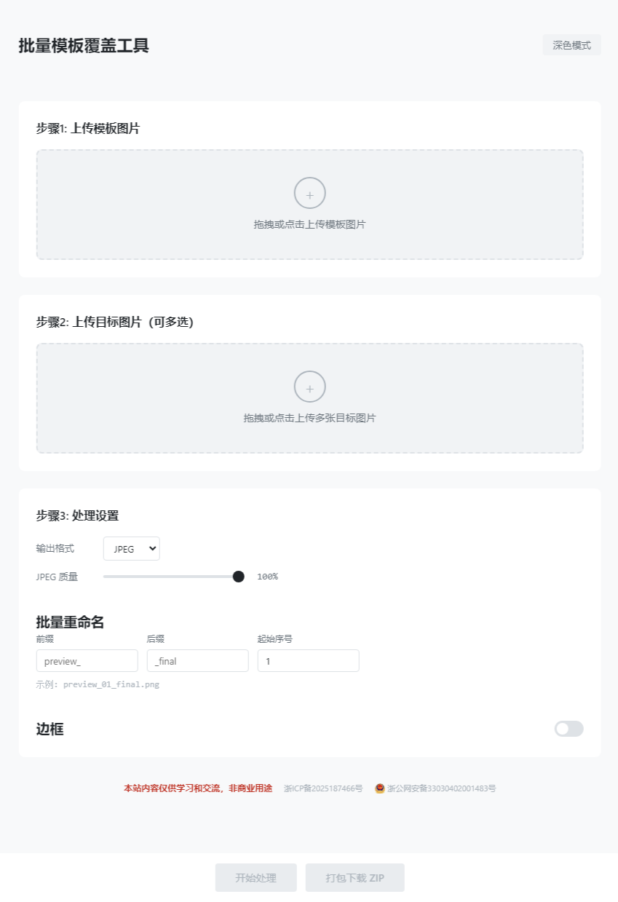

# 批量模板覆盖工具

纯前端图片批量合成工具。将模板图片覆盖到多张目标图片上，支持自定义输出格式、边框和批量重命名，最终打包为 ZIP 下载。

演示地址：https://imgoverlay.937788.xyz/

## 功能

- 上传一张模板图片和多张目标图片
- 模板自动拉伸/缩放至目标图片尺寸，覆盖叠加合成
- 支持 PNG、JPEG、WebP 输出格式，JPEG/WebP 可调质量
- 可选边框（颜色、宽度、圆角）
- 批量重命名（前缀、后缀、起始序号）
- 预览合成结果，打包下载 ZIP

## 技术栈

- Vite 6
- 原生 JavaScript (Canvas API)
- JSZip（打包下载）

## 开发

```bash
# 安装依赖
npm install

# 启动开发服务器
npm run dev

# 构建生产版本
npm run build
```

## 截图

